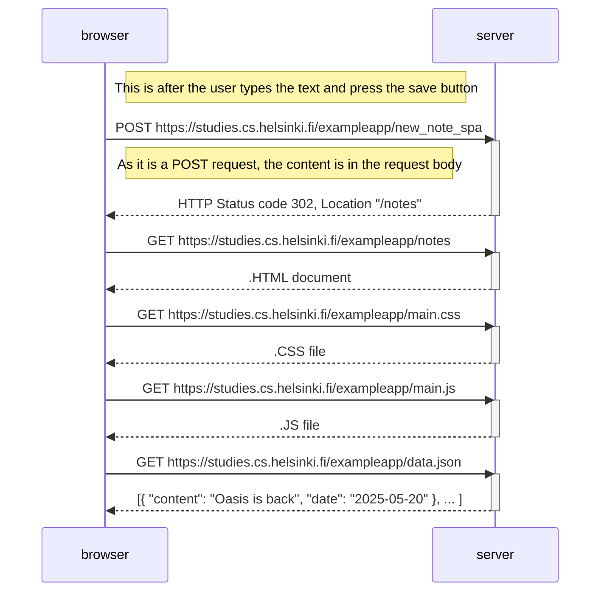

```mermaid
sequenceDiagram
 participant browser
    participant server

        Note right of browser: This is after the user types the text and press the save button
    browser->>server: POST https://studies.cs.helsinki.fi/exampleapp/new_note_spa
    activate server
        Note right of browser: As it is a POST request, the content is in the request body
    server-->>browser: HTTP Status code 302, Location "/notes"
    deactivate server

    browser->>server: GET https://studies.cs.helsinki.fi/exampleapp/notes
    activate server
    server-->>browser: .HTML document
    deactivate server

    browser->>server: GET https://studies.cs.helsinki.fi/exampleapp/main.css
    activate server
    server-->>browser: .CSS file
    deactivate server

    browser->>server: GET https://studies.cs.helsinki.fi/exampleapp/main.js
    activate server
    server-->>browser: .JS file
    deactivate server


    browser->>server: GET https://studies.cs.helsinki.fi/exampleapp/data.json
    activate server
    server-->>browser: [{ "content": "Oasis is back", "date": "2025-05-20" }, ... ]
    deactivate server

```
