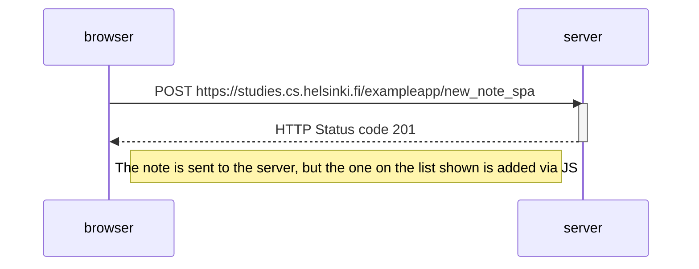

```mermaid
sequenceDiagram
 participant browser
    participant server

    browser->>server: POST https://studies.cs.helsinki.fi/exampleapp/new_note_spa
    activate server
    server-->>browser: HTTP Status code 201
    deactivate server
    Note right of browser: The note is sent to the server, but the one on the list shown is added via JS
```
